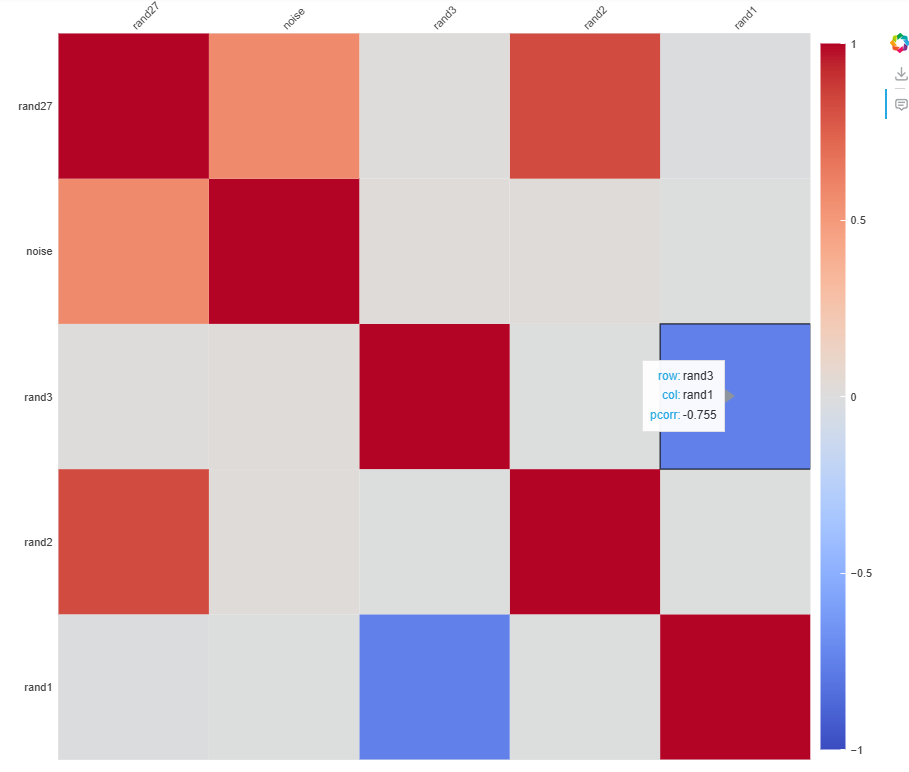

# xProb

Xiaowei's Machine Learning library for basic probability theory that are working in Databricks notebook with pyspark backend.

Here are the brief indices of implemented functions:

Tested Env: Databricks 15.4 LTS

1. pcorr4df: fast calculation of Pearson correlation among random variables within a Spark Dataframe
2. bokeh4pcorr: interactive exploring the calculated Pearson correlation coefficient; Ctrl+Click the screenshot to view: {:target="_blank"}
